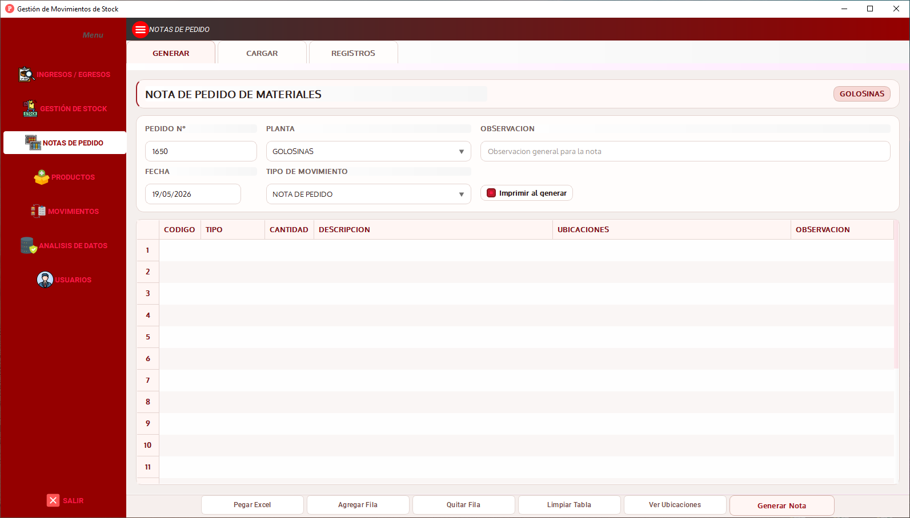

<div align="center">
  <h1>🏭 Cristian Emanuel Campos Fuentes</h1>
  <h3>Supply Chain Data Analyst | Inventory & Operational Analytics</h3>
  <h3>Power BI · SQL · Python · Process Improvement</h3>
</div>


## 👋 Sobre mí

Soy profesional de Gestión de Materiales en industria alimentaria, con experiencia directa en control de inventarios, abastecimiento operativo, trazabilidad de movimientos, análisis de consumos y prevención de faltantes en entornos industriales de alta variabilidad.

Mi perfil combina experiencia real en operaciones con herramientas de análisis y digitalización:

- 📦 Gestión operativa de inventarios y materiales.
- 🔍 Análisis de consumos, stock, movimientos y pendientes.
- 🔄 Trazabilidad y control transaccional.
- 📊 Business Intelligence aplicado a operaciones industriales.
- 🧠 Automatización y mejora de procesos internos.
- 🐍 Desarrollo de soluciones con Python, SQLAlchemy y SQL.

Mi objetivo profesional es seguir creciendo en roles de **Supply Chain Analytics, BI/Data Analyst, Operations Analytics y digitalización de procesos industriales**, construyendo soluciones basadas en problemas reales de operación.

> No vengo solo del mundo de los datos: vengo de la operación.  
> Por eso mis proyectos buscan resolver problemas reales de stock, abastecimiento, trazabilidad y toma de decisiones.

---

## 🚀 Proyectos relevantes

### 🏭 movimientos-stock-app — Industrial Stock Management System  
**Privado · En desarrollo**

Sistema de gestión de stock, movimientos, trazabilidad y Notas de Pedido desarrollado con Python, PyQt y SQLAlchemy.

El proyecto nace a partir de una necesidad operativa real: reducir la dependencia de archivos Excel dispersos, mejorar la trazabilidad de movimientos y centralizar información crítica para análisis posterior en Power BI.

**Enfoque funcional:**

- Generación y carga de Notas de Pedido.
- Registro de ingresos, egresos, ajustes, devoluciones y movimientos.
- Validaciones operativas sobre stock, productos y ubicaciones.
- Control transaccional y trazabilidad.
- Arquitectura modular orientada a mantenimiento y escalabilidad.
- Base preparada para análisis posterior con SQL y Power BI.

**Stack:**

`Python` · `PyQt` · `SQLAlchemy` · `SQL` · `Pandas` · `Power BI`

> Proyecto orientado a conectar operación real, sistema transaccional y análisis de datos.

<p align="center">
  <a href="https://github.com/CristianEmanuelCamposFuentes/CristianEmanuelCamposFuentes" target="_blank">
    
  </a>
</p>

---

### 📊 Operational Stock Dashboard — Power BI  
**Público · Dataset ficticio**

Dashboard operativo de stock desarrollado en Power BI para analizar inventarios, movimientos, pendientes y ocupación de depósito en un entorno industrial simulado.

El proyecto utiliza datos ficticios y anonimizados, manteniendo la lógica analítica de un caso real.

**Permite analizar:**

- Stock disponible, activo y crítico.
- Movimientos históricos por tipo, categoría y período.
- Pedidos pendientes y niveles de cumplimiento.
- Ocupación de depósito por pasillo, posición y ubicación.
- Indicadores operativos para abastecimiento y planificación.

**Stack:**

`Power BI` · `Power Query` · `DAX` · `Excel/CSV`


📎 *Dataset ficticio incluido para demostración.*

<h4>📸 Imágenes del proyecto: </h4>
 
<a href="https://github.com/CristianEmanuelCamposFuentes/chocogolo-powerbi" target="_blank">
  
  
  
  
</a>

---

### 📈 Industrial Operations Analytics  
**En construcción**

Repositorio orientado a análisis avanzado de operaciones industriales con datos ficticios.

**Objetivos del proyecto:**

- Simular escenarios de faltantes.
- Analizar consumo estacional.
- Aplicar clasificación ABC/XYZ.
- Calcular días de cobertura.
- Identificar productos críticos.
- Construir KPIs industriales aplicados a inventarios.

**Stack previsto:**

`Python` · `Pandas` · `SQL` · `Power BI` · `Jupyter Notebook`

---

## 🧩 Enfoque de trabajo

Mis proyectos siguen una lógica común:

```text
Operación real
→ Digitalización del proceso
→ Base de datos / modelo relacional
→ Análisis con SQL, Python o Power BI
→ Decisiones operativas
Trabajo especialmente sobre problemas de:

→ Control de inventarios.
→ Trazabilidad de movimientos.
→ Prevención de faltantes.
→ Análisis de consumos.
→ Notas de Pedido y abastecimiento interno.
→ Reporting operativo.
→ Mejora de procesos industriales.
```


<div align ="center" >
<h2>🧰 Stack Tecnológico</h2> 


<div align="center">


</div>


*La tecnología es un medio.*  
*El objetivo es optimizar operaciones industriales.* 
</div>


**Herramientas y conceptos:**

- Power BI · Power Query · DAX básico/intermedio.
- Excel avanzado · automatización operativa.
- Python · Pandas · PyQt.
- SQL · SQLAlchemy · modelado relacional.
- Git/GitHub.
- Supply Chain Analytics · Inventory Analytics · Operational KPIs.

## 🎯 Enfoque profesional

Busco desarrollarme en la intersección entre:

→ Supply Chain Operations
→ Business Intelligence
→ Data Analytics
→ Process Improvement
→ Digitalización de procesos industriales

Mi objetivo es construir soluciones que ayuden a mejorar la visibilidad operativa, reducir errores manuales, fortalecer la trazabilidad y facilitar la toma de decisiones.


<div align ="center" > <h2>🌐 Redes y contacto</h2></div>


<div align ="center" >
  
[](https://linkedin.com/in/cristian-emanuel-campos-fuentes) [](https://instagram.com/tabacampos) [](mailto:cristianemanuelcamposfuentes@hotmail.com)

---
</div>
